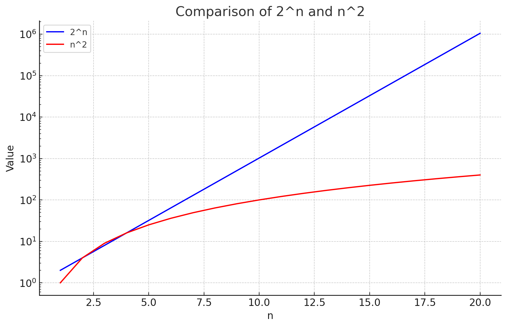

# BuySellStock

You are given an integer array prices where prices[i] is the price of a given stock on the ith day.

On each day, you may decide to buy and/or sell the stock. You can only hold at most one share of the stock at any time but you can buy it then immediately sell it on the same day.

Find and return the maximum profit you can achieve.

1 <= prices.length <= 3 * 10^4  
0 <= prices[i] <= 10^4  

The brute force recursive method in the calculate() method has complexity O(2^n).  
The following graph compares 2^n to n^2 on a log scale: 
